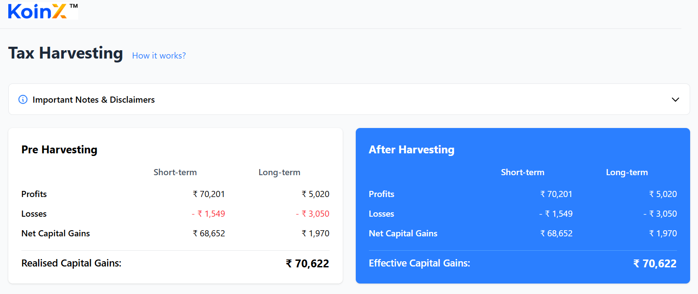
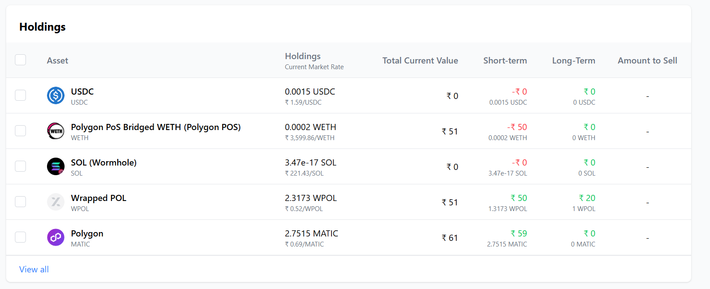

# Tax Loss Harvesting Tool

A responsive React application that helps cryptocurrency investors visualize and implement tax loss harvesting strategies. This tool calculates potential tax savings by identifying which assets could be sold for a loss to offset capital gains.

## Table of Contents

- [Features](#features)
- [Demo](#demo)
- [Tech Stack](#tech-stack)
- [Project Structure](#project-structure)
- [Setup Instructions](#setup-instructions)
- [Usage Guide](#usage-guide)
- [Implementation Details](#implementation-details)
- [Assumptions](#assumptions)
- [Future Improvements](#future-improvements)

## Features

- **Pre-Harvesting Analysis**: View your current capital gains situation before implementing any strategy
- **Interactive Holdings Table**:
  - Select assets to harvest with real-time updates
  - Sort holdings by short-term or long-term gains
  - Informative tooltips with detailed information
  - Pagination with "View All" functionality
- **After-Harvesting Calculation**: See updated tax implications and potential savings after selecting assets
- **Responsive Design**: Works seamlessly on desktop, tablet, and mobile devices
- **Dark/Light Mode**: Toggle between dark and light themes for comfortable viewing
- **Realistic Mock Data**: Uses realistic cryptocurrency market data to demonstrate functionality


## Demo

Check out the live demo: [Tax Loss Harvester Demo](https://tax-loss-harvester-xi.vercel.app/)


## Tech Stack

- **React 18**: Core UI library
- **TypeScript**: For type safety and improved developer experience
- **Tailwind CSS**: For styling and responsive design
- **Vite**: Fast, modern frontend build tool
- **React Hooks**: For state management and side effects
- **LocalStorage**: For persisting user preferences
- **Mock APIs**: For simulating backend data without requiring a server

## Project Structure

```
src/
├── components/
│   ├── layout/
│   │   ├── Header.tsx         # App header with theme toggle
│   │   └── Layout.tsx         # Main layout wrapper
│   ├── cards/
│   │   ├── PreHarvestingCard.tsx  # Shows initial capital gains
│   │   └── AfterHarvestingCard.tsx # Shows adjusted gains after selections
│   ├── holdings/
│   │   ├── HoldingsTable.tsx  # Table of crypto holdings
│   │   └── HoldingRow.tsx     # Individual row component
│   └── ui/
│       ├── Checkbox.tsx       # Reusable checkbox component
│       ├── Disclaimer.tsx     # Expandable disclaimer section
│       ├── LoadingSpinner.tsx # Loading state indicator
│       ├── ThemeToggle.tsx    # Dark/light mode toggle
│       ├── SavingsBanner.tsx  # Displays tax savings banner
│       └── ValueTooltip.tsx   # Hover tooltips for data values
├── services/
│   ├── api.ts                 # Mock API service
│   ├── types/
│   │   ├── Holdings.ts        # TypeScript interfaces for holdings
│   │   └── CapitalGains.ts    # TypeScript interfaces for capital gains
│   └── mockData/
│       ├── holdingsData.ts    # Mock cryptocurrency holdings
│       └── capitalGainsData.ts # Mock capital gains data
├── utils/
│   ├── calculator.ts          # Business logic for tax calculations
│   └── formatters.ts          # Utility functions for formatting values
├── App.tsx                    # Main application component
└── main.tsx                   # Application entry point
```

## Setup Instructions

### Prerequisites

- Node.js 16.x or higher
- npm 8.x or higher

### Installation

1. Clone the repository:

   ```bash
   git clone https://github.com/v-a-dinesh/tax-loss-harvester.git
   cd tax-loss-harvester
   ```

2. Install dependencies:

   ```bash
   npm install
   ```

3. Start the development server:

   ```bash
   npm run dev
   ```

4. Open your browser and navigate to:
   ```
   http://localhost:5173/
   ```

### Building for Production

1. Create an optimized production build:

   ```bash
   npm run build
   ```

2. Preview the production build locally:
   ```bash
   npm run preview
   ```

## Usage Guide

### Understanding the Interface

1. **Pre-Harvesting Card (Left)**: Shows your current capital gains situation:

   - Short-term and Long-term profits and losses
   - Net capital gains
   - Realized capital gains (sum of both net gains)

2. **After-Harvesting Card (Right)**: Shows capital gains after selected harvesting strategy:

   - Updated profits and losses
   - Adjusted net capital gains
   - Potential tax savings highlighted if applicable

3. **Holdings Table**: Lists your cryptocurrency assets:
   - Use checkboxes to select assets for tax loss harvesting
   - Sort by clicking on the "Short-term" or "Long-term" column headers
   - Hover over values to see detailed information
   - Use "View all" to see all holdings, or show less to see only the first 5

### Implementing a Tax Loss Harvesting Strategy

1. Review your current capital gains in the "Pre-Harvesting" card
2. Examine your holdings in the table, focusing on assets with negative gains (losses)
3. Select assets with losses to offset your capital gains
4. Watch the "After Harvesting" card update in real-time
5. If a savings banner appears, you've successfully reduced your tax liability

## Implementation Details

### Capital Gains Calculation

The tool calculates capital gains as follows:

- Net Short-term Capital Gains = Short-term profits - Short-term losses
- Net Long-term Capital Gains = Long-term profits - Long-term losses
- Realized Capital Gains = Net Short-term Capital Gains + Net Long-term Capital Gains

When assets are selected for harvesting:

- Positive gains are added to profits
- Negative gains (losses) are added to losses
- Net gains are recalculated to determine tax savings

### API Implementation

The application uses two mock APIs:

1. Holdings API: Provides cryptocurrency portfolio data
2. Capital Gains API: Provides pre-calculated capital gains information

These are implemented using promises that resolve with mock data, simulating real API calls without requiring a backend server.

## Assumptions

- Tax calculations are simplified for demonstration purposes and may not account for all tax regulations
- All values are displayed in Indian Rupees (₹)
- The application assumes assets are correctly classified as short-term or long-term
- Short-term assets are held for less than 12 months; long-term assets are held for 12+ months
- Unrealized losses in held assets are not considered for harvesting
- The tool assumes no wash sale rules (these would prevent claiming a loss if you buy the same or substantially identical security within 30 days)

## Future Improvements

- Integration with real cryptocurrency exchanges via APIs
- More sophisticated tax calculations incorporating regional tax laws
- Historical performance tracking to compare harvesting strategies
- Tax-loss harvesting automation suggestions
- PDF report generation for tax filing purposes
- Multi-currency support
- Mobile app version

---


_Note: This project was created as a frontend demonstration and is not intended as financial advice. Always consult with a qualified tax professional before implementing tax strategies._
